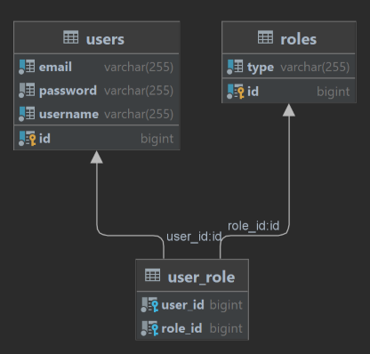

# Реализация аутентификации и авторизации с использованием Spring Security и JWT

## Описание:

Базовое веб-приложение с использованием Spring Security и JWT для аутентификации
и авторизации пользователей.

## Требования:

Настройть базовую конфигурацию Spring Security для приложения.
Использовать JWT для аутентификации пользователей.
Создать контроллеры для аутентификации и регистрации пользователей.
Реализовать сохранение пользователей в базу данных PostgreSQL.
Добавить поддержку ролей пользователей и настройть авторизацию на основе ролей.

## Технологии/зависимости

В рамках проекта используется:<br>
[](https://adoptium.net/download/)
[](https://spring.io/projects/spring-boot)
[](https://www.postgresql.org)
[](https://hibernate.org)
[](https://maven.apache.org)

### JDK

Проект написан с использованием JDK (Java) версии 21, который можно скачать,
например, по этой ссылке: https://adoptium.net/download

### Среда разработки

Можно
использовать [JetBrains IntelliJ IDEA](https://www.jetbrains.com/idea/download/), [Eclipse](https://eclipseide.org/), [NetBeans](https://netbeans.apache.org)
или [VS Code](https://code.visualstudio.com), либо любую другую совместимую с
вышеуказанными технологиями среду разработки.

### База данных

В качестве БД в проекте используется PostgreSQL. Скачать БД PostgreSQL можно
с [официального сайта](https://www.postgresql.org)
или воспользоваться [Docker](https://www.docker.com) для развёртывания.

## Основная структура проекта

Приложение представляет собой REST API через который можно зарегистрировать
нового пользователя или пройти аутентификацию для уже существующего пользователя
и получить JWT токен. Используя полученный JWT токен можно получить доступ к
защищённым данным в зависимости от ролей пользователя.

### Структура

* `SpringJwtAuthApplication` - точка входа в приложение,
* `config/*` - классы для настройки окружения,
* `entity/*` - классы-сущности для работы с репозиториями,
* `exception/*` - классы для обработки ошибок,
* `filter/JwtAuthenticationFilter` - класс-фильтр для авторизации пользователей,
* `repository/*` - интерфейсы репозитория для манипуляции с хранилищами данных,
* `rest/*` - классы для работы REST-сервиса,
* `service/*` - классы-сервисы для работы с репозиториями и другими типами
  данных

#### База данных:



Создавать структуру, как правило, нет необходимости, т.к. при первом запуске
приложения структура будет создана благодаря
работе [Hibernate](https://hibernate.org).

#### Конфигурация

- `src/main/resources/application.yml` - основной файл конфигурации
  приложения
- `src/main/resources/data.sql` - SQL данные для загрузки при старте приложения

При необходимости измените следующие параметры в файле конфигурации:

```
# Параметр устанавливающий время жизни JWT токена
jwt:
  token:
    expiration: 24h
  
# Параметр для смены порта, на котором будет работать приложение 
server:
  port: 8080

# URL адрес БД, а также имя и пароль пользователя БД:
datasource:
  url: jdbc:postgresql://localhost:5432/postgres
  username: {ПОЛЬЗОВАТЕЛЬ}
  password: {ПАРОЛЬ}
```

## Запуск приложения

Скачайте
приложение [архивом](https://github.com/mshamanov/spring-jwt-auth/archive/refs/heads/master.zip)
или с помощью следующей команды:

```
git clone https://github.com/mshamanov/spring-jwt-auth.git
```

В том случае, если запуск осуществляется непосредственно из среды
разработки, то Вы можете просто запустить метод `main`
из `dev.mash.jwtauth.SpringJwtAuthApplication`.

Другим способом будет установка через Maven:

В том случае если Maven уже установлен на Вашем компьютере, то Вы можете
запустить следующую команду **из корня проекта**:

```
mvn spring-boot:run
```

Если Maven не установлен на Вашем компьютере, то Вы можете запустить следующую
команду:

```
./mvnw spring-boot:run
```

При успешном запуске приложения будет запущен REST-сервис во время работы
которого Вам будет доступна пользовательская среда Swagger-UI для взаимодействия
с REST-сервисом по ссылке:

http://localhost:8080/swagger-ui/index.html

Вы также можете воспользоваться любым другим инструментом для обращения к REST
API, как, например, [Postman](https://www.postman.com).
Данные для взаимодействия с REST-сервисом Вы также найдёте через
пользовательскую среду Swagger-UI по ссылке выше.

Для аутентификации доступны следующие пользователи:

```
[User]
username: user
password: pwd12345

[Admin]
username: admin
password: pwd12345
```

После аутентификации полученный JWT токен передаётся в заголовке запроса
"Authorization" в качестве Bearer Token.

---

Таким образом, если всё сделано правильно, — настроена базовая аутентификация и
авторизация с использованием Spring Security и JWT, которая обеспечивает защиту
данных на основе ролей пользователей.

## Лицензия

[](https://opensource.org/licenses/MIT)